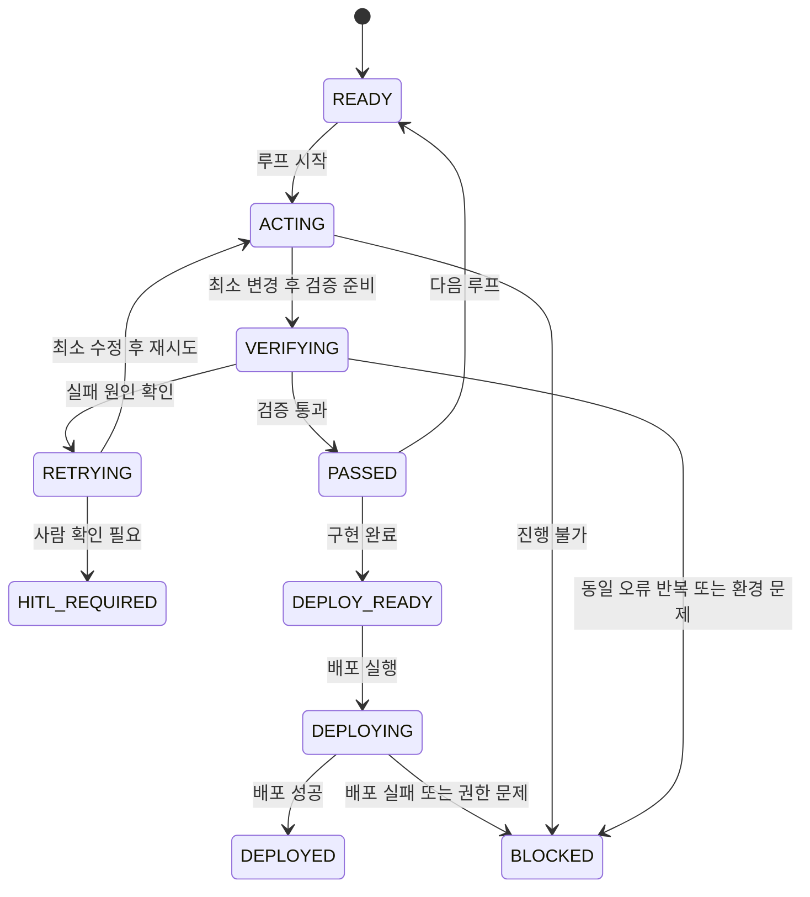

# AORR State Machine Design

이 문서는 `Step 1`에서 분석한 개발 업무와 개인 프로페셔널 웹사이트 개발 업무를, GitHub Pages에서 실행 가능한 정적 웹사이트 구현용 AORR 상태 머신으로 정리한 설계 문서다.

## 전제

- 최종 결과물은 HTML, CSS, JavaScript만으로 동작하는 정적 웹사이트다.
- 루트 디렉토리에 최소 `index.html`, `styles.css`, `script.js`가 존재해야 한다.
- 게임 코드는 `script.js` 내부에 포함하거나, 별도 JavaScript 파일로 분리할 수 있다.
- 백엔드 서버, DB, 로그인, 외부 API 호출은 필수 전제가 아니다.
- 개인 콘텐츠인 이름, 소개, 경력, 프로젝트, 이미지, 문구는 불명확하면 `[사람 확인 필요]`로 둔다.
- `Step 1` 파일은 인코딩이 손상되어 일부 세부 문구를 정확히 판독할 수 없었다. 따라서 아래 게임 요구사항 중 확정 불가 항목은 `[사람 확인 필요]`로 표시한다.

## 1. Target

### 1-1. 프로페셔널 웹사이트 개발 목표

- 개인 프로페셔널 웹사이트를 완성한다.
- 데스크톱과 모바일에서 모두 자연스럽게 동작하는 반응형 정적 사이트로 만든다.
- 상단 내비게이션에서 주요 섹션과 `Games` 탭으로 이동할 수 있게 한다.
- `Games` 탭에서 지렁이 게임을 직접 플레이할 수 있게 한다.
- 모든 핵심 기능은 브라우저만으로 실행 가능해야 한다.

### 1-2. GitHub Pages 배포 목표

- GitHub Pages 루트에서 바로 열리는 구조로 만든다.
- 상대 경로 오류 없이 정적 파일만으로 배포되게 한다.
- 빌드 단계가 없어도 동작하도록 구성한다.
- GitHub Pages의 정적 호스팅 제약을 만족해야 한다.

### 1-3. 입력 자료

- 사용자 요구사항 본문
- `Step 1` 분석 내용
- 저장소의 기존 파일 구조
- 개인 콘텐츠 자료: 이름, 소개, 경력, 프로젝트, 연락처, 소셜 링크, 이미지, Games 섹션 문구
- `Step 1`의 `[게임 추가 기능:]` 항목
- GitHub Pages 배포 대상 저장소 구조

### 1-4. 필수 페이지와 섹션

- Hero 또는 Home
- About
- Projects
- Experience
- Contact
- `Games`
- `[사람 확인 필요]` 섹션 명칭은 실제 콘텐츠와 기존 정보에 맞춰 조정 가능

### 1-5. Games 탭 및 지렁이 게임 요구사항

- 상단 내비게이션에 `Games` 탭이 있어야 한다.
- `Games` 탭 진입 시 지렁이 게임이 보이고 즉시 플레이 가능해야 한다.
- 게임은 키보드 조작을 지원해야 한다.
- 게임은 모바일 터치 조작을 지원해야 한다.
- 게임은 시작, 일시정지, 재시작, 점수 표시가 가능해야 한다.
- 게임은 먹이, 성장, 충돌 판정, 게임 오버를 처리해야 한다.
- `Step 1`에 `[게임 추가 기능:]`이 존재하면 아래 후보 기능을 게임 루프에 반영한다.
  - 시작
  - 자동 이동
  - 먹이 생성
  - 성장
  - 벽 충돌
  - 자기 몸 충돌
  - 점수 증가
  - 방향 전환
  - 키보드 조작
  - 모바일 버튼 또는 스와이프 조작
  - 일시정지
  - 재시작
  - 난이도 조절
  - 속도 증가
  - 장애물
  - [사람 확인 필요] 적 지렁이 또는 추가 모드가 실제 요구사항인지 확인

### 1-6. 데스크톱 및 모바일 완료 기준

- 375px, 768px, 1440px 폭에서 가로 스크롤이 없어야 한다.
- 내비게이션이 겹치거나 잘리지 않아야 한다.
- `Games` 탭과 게임 조작이 모바일에서도 사용 가능해야 한다.
- 브라우저 콘솔 오류가 없어야 한다.
- GitHub Pages 경로에서 정적 로딩이 정상이어야 한다.
- 터치 조작, 키보드 조작, 클릭 조작이 모두 의도한 대로 동작해야 한다.

## 2. Act

### 2-1. 한 번의 개발 루프에서 수행할 최소 작업

- 하나의 실패 원인만 수정한다.
- 관련된 최소 파일만 수정한다.
- 수정 후 동일한 verifier를 다시 실행한다.
- 기존에 통과한 기능이 있으면 회귀 테스트를 함께 확인한다.

### 2-2. 수정 가능한 파일 범위

- `index.html`
- `styles.css`
- `script.js`
- 필요 시 별도 게임 JavaScript 파일

### 2-3. 생성할 수 있는 파일

- `index.html`
- `styles.css`
- `script.js`
- `game.js` 또는 게임 전용 JavaScript 파일
- 정적 자산 파일들
- `AORR.md`
- `[사람 확인 필요]` 실제 콘텐츠 관리용 메모 파일은 필요 시 추가 가능

### 2-4. 실행 가능한 로컬 검증 명령어

설계 단계에서는 아래처럼 검증 루프를 상정한다.

- `git status --short`
- `Test-Path index.html`
- `Test-Path styles.css`
- `Test-Path script.js`
- `python -m http.server 8000`
- `npx serve .`
- 브라우저에서 `http://localhost:8000` 접속
- 개발자 도구 콘솔 확인

### 2-5. 기본 Act 순서

1. 저장소와 기존 파일을 확인한다.
2. 실패 원인을 하나만 선택한다.
3. 관련된 최소 파일만 수정한다.
4. 로컬 서버와 브라우저에서 검증한다.
5. 실패가 남으면 동일한 원인만 다시 수정한다.

## 3. Observe

각 루프에서 다음 항목을 관찰한다.

- 파일 생성 여부
- HTML 오류
- CSS 오류
- JavaScript 오류
- 게임 로직 오류
- 로컬 웹서버 응답
- 브라우저 콘솔 오류
- 데스크톱 화면 상태
- 모바일 화면 상태
- 키보드 조작
- 터치 조작
- GitHub Pages 호환성

추가 관찰 기준:

- 콘텐츠 문구가 실제 개인 정보와 일치하는지
- 이미지와 링크가 끊기지 않는지
- 상대 경로가 GitHub Pages에서 정상 동작하는지
- `Games` 탭 전환 후 상태가 유지되는지

## 4. Reason

실패 원인은 다음 중 하나로만 분류한다.

- `HTML_STRUCTURE`
- `CSS_RESPONSIVE`
- `JAVASCRIPT`
- `GAME_LOGIC`
- `GAME_CONTROL`
- `CONTENT`
- `TEST`
- `ENVIRONMENT`
- `GITHUB_PERMISSION`
- `DEPLOYMENT`
- `UNKNOWN`

분류 기준:

- DOM 구조, 잘못된 태그 중첩, 링크 누락, 시맨틱 구조 문제는 `HTML_STRUCTURE`
- 화면 깨짐, 오버플로, 반응형 브레이크포인트 불일치는 `CSS_RESPONSIVE`
- 스크립트 로딩 실패, null 참조, 이벤트 바인딩 실패는 `JAVASCRIPT`
- 지렁이 이동, 먹이 생성, 충돌, 점수, 난이도 규칙 오류는 `GAME_LOGIC`
- 키보드, 터치, 버튼, 패드와 같은 조작 입력 오류는 `GAME_CONTROL`
- 소개글, 경력, 프로젝트, 연락처, 문구 불일치나 누락은 `CONTENT`
- 검증 스크립트, 테스트 절차, verifier 실패는 `TEST`
- 로컬 서버, 경로, 브라우저, 실행 환경, 정적 호스팅 제약은 `ENVIRONMENT`
- 저장소 권한, 푸시 권한, Pages 설정 접근 불가 문제는 `GITHUB_PERMISSION`
- GitHub Pages 배포 실패, 배포 경로 오류, 공개 반영 실패는 `DEPLOYMENT`
- 위 항목으로 설명되지 않으면 `UNKNOWN`

## 5. Repeat

반복 규칙:

1. 한 번에 하나의 실패 원인만 수정한다.
2. 관련된 최소 파일만 변경한다.
3. 수정 후 동일한 verifier를 다시 실행한다.
4. 이미 통과한 기능에 대한 회귀 테스트를 함께 실행한다.
5. 같은 fingerprint가 반복되면 추가 수정 전에 원인을 재분류한다.

권장 반복 단위:

- 구조 문제 1회 수정
- 스타일 문제 1회 수정
- 스크립트 문제 1회 수정
- 게임 조작 문제 1회 수정
- 반응형 문제 1회 수정
- 배포 호환성 문제 1회 수정

## 6. Stop

다음 중 하나면 루프를 멈춘다.

- 전체 테스트가 통과한 경우
- 최대 Retry에 도달한 경우
- 동일한 오류 fingerprint가 2회 반복된 경우
- 개인정보나 콘텐츠 확인이 필요한 경우
- GitHub 인증 또는 배포 권한 문제가 발생한 경우

종료 상태 후보:

- `PASSED`
- `DEPLOY_READY`
- `DEPLOYED`
- `BLOCKED`
- `HITL_REQUIRED`

## 7. Human-in-the-loop

다음 경우에는 `[사람 확인 필요]`로 중단한다.

- 이름, 소개, 경력, 프로젝트, 연락처가 불명확한 경우
- 기존 콘텐츠 삭제가 필요한 경우
- 외부 분석 도구 또는 외부 서비스를 추가해야 하는 경우
- GitHub 저장소 설정을 변경해야 하는 경우
- 요구사항이 서로 충돌하는 경우
- `Step 1`의 게임 추가 기능 원문을 정확히 판독해야 하는 경우
- 게임의 적 지렁이, 장애물, 난이도, 속도 규칙이 실제 의도와 다른지 확인이 필요한 경우

## 8. State Machine

상태 의미:

- `READY`: 다음 작업을 시작하기 전 대기
- `ACTING`: 파일 수정 또는 구조 구성 중
- `VERIFYING`: 로컬 서버, 콘솔, 화면, 게임 조작을 확인 중
- `RETRYING`: 실패 원인을 좁혀 다시 시도 중
- `PASSED`: 현재 루프 목표가 통과
- `DEPLOY_READY`: 배포 직전 상태
- `DEPLOYING`: GitHub Pages 배포 수행 중
- `DEPLOYED`: 배포 완료
- `BLOCKED`: 권한, 환경, 반복 실패로 더 이상 진행 불가
- `HITL_REQUIRED`: 사람 확인 없이는 진행 불가

## 9. Small Loop Breakdown

아래 표는 전체 개발 업무를 작은 루프로 나눈 것이다.

| 단계 | 상태 | 입력 | Act | Observe | 출력 | 테스트 기준 | 다음 상태 | Human-in-the-loop |
|---|---|---|---|---|---|---|---|---|
| 저장소 및 기존 파일 확인 | `READY` | 저장소 루트, 기존 파일 목록, Step 1 요약 | 파일 구조, Pages 대상, 기존 충돌 여부를 확인한다 | 루트 파일, 숨김 파일, 기존 정적 자산, 충돌 가능성 | 작업 범위 확정 | 필수 루트 파일 존재 여부와 기존 구조 파악 완료 | `ACTING` 또는 `BLOCKED` | 저장소 범위가 불명확하면 필요 |
| 정적 사이트 기본 구조 | `ACTING` | 입력 자료, 필수 페이지 목록 | `index.html`의 기본 뼈대와 `styles.css` 연결을 구성한다 | 헤더, 메인, 섹션, 푸터, 메타 태그, 모바일 뷰포트 | 기본 페이지 구조 | HTML 구조가 유효하고 루트 파일이 로드됨 | `VERIFYING` | 페이지 명칭 충돌 시 필요 |
| 프로페셔널 콘텐츠 영역 | `ACTING` | 소개, 경력, 프로젝트, 연락처 | Hero, About, Projects, Experience, Contact 섹션을 배치한다 | 콘텐츠 순서, CTA, 링크, 문구 길이 | 콘텐츠 섹션 초안 | 텍스트가 누락 없이 표시됨 | `VERIFYING` 또는 `HITL_REQUIRED` | 이름, 소개, 경력, 프로젝트가 불명확하면 필요 |
| 반응형 내비게이션 | `VERIFYING` | 데스크톱 및 모바일 폭 | 상단 내비게이션, 햄버거 메뉴, 스크롤 대응을 구현한다 | 375px, 768px, 1440px에서 메뉴 겹침 여부 | 반응형 내비게이션 | 메뉴가 겹치지 않고 탭 이동 가능 | `ACTING` 또는 `PASSED` | 메뉴 라벨 변경이 필요하면 필요 |
| Games 탭 | `ACTING` | 내비게이션 구조, Games 목적 | `Games` 탭과 게임 컨테이너 진입점을 만든다 | 탭 전환, 앵커 이동, 섹션 노출 | Games 진입 구조 | `Games` 탭이 즉시 보여야 함 | `VERIFYING` | `Games` 명칭 변경이 필요하면 필요 |
| 지렁이 게임 핵심 로직 | `ACTING` | 게임 규칙, Step 1 추가 기능 | 지렁이 이동, 먹이, 성장, 충돌, 점수를 구현한다 | 게임 상태, 틱 진행, 종료 조건, 재시작 | 플레이 가능한 게임 코어 | 기본 게임 루프가 멈추지 않고 규칙대로 동작 | `VERIFYING` 또는 `RETRYING` | 적 지렁이, 장애물, 속도 규칙은 확인 필요일 수 있음 |
| 키보드 조작 | `VERIFYING` | 게임 포커스, 방향 입력 | 방향키 또는 WASD 입력을 연결한다 | 반대 방향 금지, 즉시 반응, 입력 누락 | 키보드 컨트롤 | 키보드로 안정적으로 조작 가능 | `PASSED` 또는 `RETRYING` | 추가 단축키가 있으면 필요 |
| 모바일 터치 조작 | `VERIFYING` | 터치 버튼, 스와이프 정책 | 모바일 버튼 또는 스와이프 입력을 연결한다 | 터치 반응, 버튼 크기, 오조작 방지 | 모바일 조작 UI | 손가락으로 플레이 가능 | `PASSED` 또는 `RETRYING` | 제스처 방식이 미확정이면 필요 |
| 게임 UI 및 점수 | `VERIFYING` | 점수, 시작, 일시정지, 재시작 | HUD, 상태 메시지, 점수 표시를 정리한다 | 점수 증가, 게임 오버 문구, 버튼 상태 | 게임 UI 완성 | 점수와 상태가 명확히 보임 | `PASSED` 또는 `RETRYING` | 점수 규칙이 모호하면 필요 |
| 접근성과 반응형 검증 | `VERIFYING` | 완성된 HTML, CSS, JS | 키보드 포커스, 대비, 스크린 너비, 오버플로를 검증한다 | 콘솔 오류, 가로 스크롤, 터치 영역, 접근성 | 반응형 검증 결과 | 주요 브레이크포인트에서 레이아웃 안정 | `PASSED` 또는 `RETRYING` | 접근성 기준을 더 강화해야 하면 필요 |
| GitHub Pages 호환성 검증 | `DEPLOY_READY` | 정적 파일, 상대 경로, Pages 제약 | 절대 경로 의존성, 빌드 의존성, 로컬 전용 API 사용 여부를 점검한다 | 정적 로딩, 상대 경로, 캐시 문제, 링크 깨짐 | 배포 직전 상태 | GitHub Pages에서 정적으로 열릴 수 있어야 함 | `DEPLOY_READY` 또는 `BLOCKED` | 저장소 설정 변경이 필요하면 필요 |
| 배포 | `DEPLOYING` | GitHub Pages 설정, 배포 대상 브랜치 | Pages 배포를 실행하고 공개 URL을 확인한다 | 배포 성공 여부, 공개 반영, 접속 오류 | 배포 결과 | 공개 URL에서 사이트가 열린다 | `DEPLOYED` 또는 `BLOCKED` | 인증, 권한, 저장소 설정 문제가 있으면 필요 |

## 10. Loop Rules by Phase

### 10-1. 저장소 및 기존 파일 확인

- 목적: 작업 대상과 제약을 확정한다.
- 실패 원인 예시: 누락된 루트 파일, 다른 프로젝트 충돌, Pages 대상 불명확.
- 통과 기준: 루트 구조와 현재 상태를 파악했다.

### 10-2. 정적 사이트 기본 구조

- 목적: HTML의 뼈대를 만든다.
- 실패 원인 예시: 잘못된 시맨틱 구조, `script` 및 `link` 누락.
- 통과 기준: 브라우저에서 빈 껍데기라도 열리고 섹션이 식별된다.

### 10-3. 프로페셔널 콘텐츠 영역

- 목적: 개인 웹사이트의 핵심 정보 구조를 만든다.
- 실패 원인 예시: 섹션 누락, 콘텐츠 중복, 소개 누락.
- 통과 기준: Hero, About, Projects, Experience, Contact가 보인다.

### 10-4. 반응형 내비게이션

- 목적: 데스크톱과 모바일 모두에서 이동 가능하게 만든다.
- 실패 원인 예시: 메뉴 겹침, 토글 실패, 앵커 점프 문제.
- 통과 기준: 모든 폭에서 내비게이션이 사용 가능하다.

### 10-5. Games 탭

- 목적: 게임 진입점을 제공한다.
- 실패 원인 예시: 탭이 보이지 않음, 링크가 동작하지 않음, 섹션 전환 실패.
- 통과 기준: `Games` 탭에서 게임 화면으로 이동한다.

### 10-6. 지렁이 게임 핵심 로직

- 목적: 게임의 본체를 만든다.
- 실패 원인 예시: 방향 전환 오류, 먹이 충돌 누락, 성장 미적용, 게임 오버 미발동.
- 통과 기준: 기본 플레이 루프가 정상적으로 돈다.

### 10-7. 키보드 조작

- 목적: PC에서 조작 가능하게 만든다.
- 실패 원인 예시: 입력 지연, 반대 방향 금지 미적용, 포커스 문제.
- 통과 기준: 방향키 또는 WASD로 안정적으로 조작된다.

### 10-8. 모바일 터치 조작

- 목적: 휴대기기에서도 플레이 가능하게 만든다.
- 실패 원인 예시: 버튼이 작음, 터치 이벤트가 안 잡힘, 스와이프 인식 실패.
- 통과 기준: 손가락으로 방향 전환이 가능하다.

### 10-9. 게임 UI 및 점수

- 목적: 상태를 읽기 쉽게 만든다.
- 실패 원인 예시: 점수 미표시, 게임 오버 안내 부족, 재시작 경로 없음.
- 통과 기준: 점수와 상태가 즉시 이해된다.

### 10-10. 접근성과 반응형 검증

- 목적: 다양한 환경에서 읽기 쉽고 조작 가능하게 한다.
- 실패 원인 예시: 가로 스크롤, 대비 부족, 포커스 손실, 브라우저 콘솔 오류.
- 통과 기준: 핵심 화면과 조작이 데스크톱 및 모바일에서 모두 안정적이다.

### 10-11. GitHub Pages 호환성 검증

- 목적: 배포 전 정적 호스팅 제약을 제거한다.
- 실패 원인 예시: 로컬 전용 경로, 빌드 산출물 의존, 상대 경로 오류.
- 통과 기준: Pages에서 직접 열 수 있는 구조다.

### 10-12. 배포

- 목적: 공개 URL로 서비스한다.
- 실패 원인 예시: 권한 문제, Pages 설정 문제, 배포 반영 지연.
- 통과 기준: 공개 URL 접속이 가능하다.

## 11. Recommended First Loop

가장 먼저 수행할 루프는 `저장소 및 기존 파일 확인`이다.

이유:

- 실제 작업 대상이 맞는지 먼저 확인해야 한다.
- 기존 구조를 모르고 덮어쓰면 회귀 위험이 커진다.
- Step 1의 게임 추가 기능 원문이 손상되어 있으므로, 먼저 범위를 확정해야 한다.

## 12. Notes

- `Step 1`에 `[게임 추가 기능:]`이 실제로 적혀 있다면, 해당 내용은 게임 루프에 우선 반영한다.
- 현재 원문은 인코딩 손상으로 일부 항목을 정확히 읽을 수 없었으므로, 확정 불가 항목은 `[사람 확인 필요]`로 남긴다.
- 이 문서는 설계 문서이며, 코드 수정, 테스트 실행, 배포는 포함하지 않는다.

## Self-Correcting TDD Loop

This section defines the verifier-first loop for the static GitHub Pages site.

### 1. Available verifiers in this environment

Confirmed locally:

- `git` is installed and executable.
- `claude` CLI is installed and executable.
- `claude doctor` runs successfully.
- `claude auto-mode config` runs successfully.

Not currently usable from this shell:

- `python` exists only as a Windows Apps router and fails to launch.
- `py` is not installed.
- `node` is not installed.
- `npx` is not installed.

Implication:

- Do not invent `npm`, `npx`, or `python3` commands unless they are actually present in the current run.
- Prefer verification commands that were confirmed to exist.
- If a local static server is needed later, treat it as `ENVIRONMENT` until a real executable server command is found.

### 2. Claude Code CLI model selection

Current verified facts:

- Claude Code CLI version: `2.1.208`
- `claude doctor` reports a healthy install
- `~/.claude/settings.json` reports `"model": "sonnet"`
- A direct API check could not be completed because `claude` is not logged in in this shell

Recorded model status:

- Current configured Claude model: `sonnet`
- Sonnet 5 availability: `[사람 확인 필요]`
- Exact underlying Sonnet generation: `[사람 확인 필요]`

Policy:

- If a later authenticated `claude` invocation confirms a Sonnet 5 family model, use it and record the exact model string.
- Otherwise use the configured `sonnet` model alias and record that exact alias in the verifier log.

### 3. Verifier-first loop

Use this loop for every failure fingerprint:

1. Discover the smallest failing surface.
2. Run the narrowest verifier that can reproduce the failure.
3. Classify the failure into exactly one Reason bucket.
4. Apply the minimum fix to the minimum file set.
5. Re-run the same verifier.
6. Re-run only the already-passed regression checks that could be affected.
7. Stop when the fingerprint clears, repeats twice, or requires human input.

### 4. Minimum verifier set

Use only verifiers that match the current environment and project state.

#### File and structure checks

- `git status --short`
- `Test-Path index.html`
- `Test-Path styles.css`
- `Test-Path script.js`
- `git ls-files --error-unmatch index.html styles.css script.js`

#### HTML checks

- Open the generated page in a browser or browser tool and inspect document structure.
- Confirm `title`, `meta viewport`, semantic landmarks, navigation links, and the `Games` area.
- Check for broken internal links and missing `alt` text.

#### CSS checks

- Use browser viewport inspection at roughly `375px`, `768px`, and `1440px`.
- Check for horizontal overflow, layout collisions, and nav/game UI behavior.

#### JavaScript checks

- Use the browser console to catch syntax errors, null references, and duplicate listeners.
- Verify page-load behavior and event wiring.

#### Game checks

- Start, pause, restart, score, food spawn, wall collision, self-collision.
- Keyboard arrows or WASD.
- Mobile buttons or touch gestures.
- Prevent immediate reverse direction.
- Re-entering `Games` must not create duplicate game loops.

#### GitHub Pages compatibility checks

- Root-level `index.html`.
- Relative static asset paths only.
- No backend dependency.
- No local filesystem dependency at runtime.

### 5. Failure log schema

When a check fails, log all of the following:

- Executed command
- Exit code
- Failed verification item
- Core error message
- Related file(s) and line(s)
- Browser console message(s)
- Error fingerprint

Fingerprint format:

- Normalize the verifier name, failing check, primary error string, and primary file:line pair.
- Keep the fingerprint stable across repeated runs of the same issue.
- If the same fingerprint appears twice, stop retrying that issue.

### 6. Failure classification rules

Use exactly one reason per failure.

- `HTML_STRUCTURE`: malformed DOM, invalid nesting, missing semantic structure, broken links due to markup.
- `CSS_RESPONSIVE`: overflow, collision, broken layout, breakpoint failure.
- `JAVASCRIPT`: syntax errors, null references, event binding failures, page-load exceptions.
- `GAME_LOGIC`: movement, food, growth, collision, score, speed, or state rules.
- `GAME_CONTROL`: keyboard, touch, button, swipe, pause/restart control wiring.
- `CONTENT`: missing or inconsistent personal content, project text, labels, or copy.
- `TEST`: verifier script failure, bad assertion, bad test procedure, missing check.
- `ENVIRONMENT`: missing runtime, missing tool, server problem, browser issue, path issue.
- `GITHUB_PERMISSION`: repo access, auth, branch protection, or Pages settings access.
- `DEPLOYMENT`: GitHub Pages publish failure, path mismatch, or public update not applied.
- `UNKNOWN`: only when none of the above fits.

### 7. Retry policy

- One retry fixes one reason only.
- Change only the files needed for that reason.
- Do not weaken or delete tests.
- Do not rewrite unrelated parts of the site.
- Do not switch frameworks.
- After each fix, re-run the same verifier before adding any broader regression checks.
- Preserve all previously passing behavior.

### 8. Stop policy

Stop the loop when any of the following is true:

- All required checks pass.
- The issue reaches the maximum of 3 retries.
- The same fingerprint repeats twice.
- Personal-content confirmation is needed.
- GitHub authentication or Pages permission blocks progress.

Stop states:

- `PASSED`
- `DEPLOY_READY`
- `DEPLOYED`
- `BLOCKED`
- `HITL_REQUIRED`

### 9. Recommended verifier order

1. File existence and link wiring.
2. HTML structure and semantics.
3. CSS responsiveness and overflow.
4. JavaScript console and load behavior.
5. Game logic and controls.
6. Browser viewport regression at mobile, tablet, and desktop widths.
7. GitHub Pages compatibility.
8. Deployment only after local verification is clean.

### 10. GitHub Pages verifier constraints

- Verify only static hosting behavior that GitHub Pages supports.
- Do not rely on backend APIs.
- Do not rely on runtime writes to the local filesystem.
- Do not rely on absolute local file paths in production code.
- Treat any path or asset resolution bug as a deployment-risk defect until proven otherwise.

### 11. Output contract for each retry

For every retry attempt, record:

- Hypothesis
- Changed file(s)
- Executed verifier command(s)
- Result
- Whether the current fingerprint changed

If the issue is environmental or permission-based, do not attempt to fix it in code; mark it as `ENVIRONMENT`, `GITHUB_PERMISSION`, or `DEPLOYMENT` as appropriate and stop or escalate.

## Loop Status Note

- 기본 구조 루프는 완료되었다.
- `index.html`, `styles.css`, `script.js`가 루트에 존재한다.
- 이후 루프는 이 기본 뼈대를 보존하면서 반응형 세부 조정, 콘텐츠 정리, `Games` 기능 확장 순으로 진행했다.
- `Research` 섹션이 추가되어 프로필 섹션 구조가 조금 더 명확해졌고, 현재는 지렁이 게임과 반응형 포트폴리오가 구현된 상태다.
- 다음 단계는 배포 승인 후 GitHub Pages 최초 배포다.

# 개선 요구 항목

- 화면이 작은 경우에 game의 컨트롤 탭이 화면과 멀리 떨어져 있어서 사용 불가
- 여러 언어 지원(기본 : 한글, 추가 : 영어)
- game에서 난이도(level) 속성 추가해줘.(SCORE 10점 올라갈때마다 속도 1단계씩 올라가도록)
- 라이트/다크 선택 가능하도록 기능 추가해줘
- 화면 좌측에 indexing을 위한 스크롤 추가해줘
- 버튼이 실제로 눌리는 즉시 방향이 바뀌지 않아
- 타겟이 여러개 생성되는 시나리오도 추가되었으면 좋겠어
## Change Request Loop Plan

이 섹션은 사용자 수정 요청을 실행 가능한 변경 루프로 분해한 계획이다.

### 기준선
- 마지막 정상 배포 commit: `598ffbb00b0f7e6f1f0f7e60ddadea01e4b1d959`
- 마지막 정상 배포 URL: `https://kwang-corp.github.io/`
- Change Request ID: `CR-20260714-001`

### Change Item 요약
- `CR-001`: 작은 화면에서 게임 조작 패널이 너무 멀다.
- `CR-002`: 버튼을 누르는 즉시 방향이 바뀌지 않는다.
- `CR-003`: 기본 한글, 추가 영어 다국어 지원이 필요하다.
- `CR-004`: 라이트/다크 테마 선택 기능이 필요하다.
- `CR-005`: 화면 좌측 indexing/스크롤 보조 UI가 필요하다.
- `CR-006`: 점수 10점마다 level이 올라가고 속도가 빨라져야 한다.
- `CR-007`: 여러 타겟이 생성되는 시나리오가 필요하다.

### 실행 순서
1. 기준선과 현재 상태 확인
2. `CR-001` 모바일 조작 접근성 개선
3. `CR-002` 버튼 즉시 반응 문제 수정
4. `CR-006` level/속도 규칙 추가
5. `CR-007` 다중 타겟 시나리오 추가
6. `CR-003` 다국어 지원
7. `CR-004` 라이트/다크 전환
8. `CR-005` 좌측 indexing 보조 UI
9. 전체 회귀 테스트와 GitHub Pages 호환성 검증

### 상태 전이
- 기준선 확인: `READY`
- 변경 계획 확정: `CHANGE_PLANNED`
- 구현 착수: `ACTING`
- 검증 수행: `VERIFYING`
- 실패 재시도: `RETRYING`
- 완료: `PASSED`
- 배포 준비: `DEPLOY_APPROVAL_REQUIRED`
- 배포 중: `DEPLOYING`
- 배포 완료: `DEPLOYED`
- 사람 확인 필요: `HITL_REQUIRED`

### Verifier
- 저장소 구조와 git 상태 확인
- 브라우저에서 모바일/태블릿/데스크톱 확인
- 게임 조작, 난이도, 다중 타겟, 언어, 테마 검증
- GitHub Pages 호환성 확인

### HITL 조건
- `CR-005`의 "indexing" 의미가 불명확할 때
- `CR-007`의 다중 타겟 규칙이 불명확할 때
- `CR-003`의 번역 범위가 불명확할 때
- `CR-004`의 기본 테마 선호가 필요할 때

### Stop 조건
- 전체 회귀 테스트가 통과할 때
- 동일 fingerprint가 2회 반복될 때
- Retry 최대치에 도달할 때
- 사람 확인이 필요한 내용이 남아 있을 때

### Execution Update
- `CR-001` 상태: `PASSED`
  - 변경 파일: `index.html`, `styles.css`
  - 결과: 모바일에서 게임 조작 패널이 보드 앞쪽에 배치됨
- `CR-002` 상태: `PASSED`
  - 변경 파일: `game.js`
  - 결과: pointerdown 입력으로 즉시 방향 전환 확인
- `CR-006` 상태: `PASSED`
  - 변경 파일: `index.html`, `styles.css`, `game.js`
  - 결과: score 10점마다 level 증가 및 stepDelay 감소 확인
- `CR-007` 상태: `BLOCKED`
  - 사유: 다중 타겟 생성 규칙이 아직 불명확함
- `CR-003` 상태: `READY`
- `CR-004` 상태: `READY`
- `CR-005` 상태: `HITL_REQUIRED`
## Re-Verification Update
- `CR-003`: `PASSED`
  - Target: Korean default language and English toggle
  - Act: rewrote `script.js` to apply locale copy and sync the snake game locale
  - Observe: browser shows Korean by default, English after toggle, no console errors
  - Reason: `CONTENT`, `INFORMATION_ARCHITECTURE`
  - Verifier: Playwright + system Chrome on `375px` and `1440px`
  - Stop: satisfied
- `CR-004`: `PASSED`
  - Target: light/dark theme toggle
  - Act: kept theme application in `script.js` and verified CSS theme variables
  - Observe: `data-theme` toggles correctly and style changes are reflected, no console errors
  - Reason: `UI_UX`, `ACCESSIBILITY`
  - Verifier: Playwright + system Chrome on `375px` and `1440px`
  - Stop: satisfied
- `CR-005`: `HITL_REQUIRED`
  - `indexing` meaning is still ambiguous
- `CR-007`: `BLOCKED`
  - multi-target spawn rules are still undefined
